# Retail Customer Sales Performance Analysis
## *Advanced Analytics for Strategic Business Intelligence*

<div align="center">


</div>

---

## 🎯 **Business Problem Statement**

Stores gather endless shopping data, but making sense of it is hard. This project turns raw sales numbers into clear business strategies for growth and happier customer

### **Core Challenge:**
> *"How can retailers use customer behavior, demographics, and location data to improve product placement, segment customers effectively, and boost store performance?"*

---

## 💡 **Solution Architecture**

<div align="center">


</div>

### **Three-Tier Analytical Approach:**

**🔹 Tier 1: Data Processing**
- Clean and transform raw data with Python 
- Combine multiple sources for consistency 
- Prepare accurate datasets for analysis

**🔹 Tier 2: Business Intelligence**
- Build interactive dashboards in Power BI 
- Use DAX for advanced business metrics
- Enable real-time reporting and visualization 

**🔹 Tier 3: Strategy & Insights**
- Segment customers for better targeting 
- Map performance by region 
- Optimize product categories for growth 

---

## 🛠️ **Technology Stack**

<div align="center">

| Technology | Purpose | Implementation Status |
|------------|---------|---------------------|
|  | Data Processing & Analysis | ✅ **Active Development** |
|  | Interactive Dashboards | 🔄 **In Progress** |
|  | Data Manipulation | ✅ **Implemented** |
|  | Advanced Calculations | 📋 **Planned** |
|  | Data Storage & Validation | ✅ **Ready** |

</div>

---

## 📊 **Expected Business Outcomes**

### **Primary Analytical Deliverables:**

## 📊 **Expected Business Outcomes**

### **Key Deliverables**

**🎯 Customer Behavior Analysis**  
- Understand gender-based buying patterns  
- Link spending habits with age groups  
- Segment customers by lifetime value  

**🗺️ Geographic Insights**  
- Map city-level sales performance  
- Measure regional market reach  
- Optimize inventory by location  

**🏆 Store Performance**  
- Rank stores by revenue contribution  
- Connect sales with customer satisfaction  
- Track operational efficiency  

**📈 Product Intelligence**  
- Compare sales across major categories  
- Analyze cross-category purchases  
- Forecast seasonal demand trends  


---

## 🚀 **Project Development Timeline**

<div align="center">

```
📅 DEVELOPMENT PHASES

Phase 1: Data Architecture Setup    [████████████████████] 100%
Phase 2: Python Analytics Engine    [████████████░░░░░░░░] 65%  
Phase 3: Pattern Recognition        [██████░░░░░░░░░░░░░░] 30%
Phase 4: Power BI Dashboard Dev     [████░░░░░░░░░░░░░░░░] 20%
Phase 5: DAX Formula Implementation [██░░░░░░░░░░░░░░░░░░] 10%
Phase 6: Final Report Generation    [░░░░░░░░░░░░░░░░░░░░] 0%

```

</div>

**Current Focus:**
- 🔬 **Data Mining**: Applying advanced methods to uncover patterns  
- 📊 **Dashboard Design**: Building interactive and user-friendly Power BI views  
- 🧮 **Business Logic**: Developing smart DAX calculations for key metrics  


---

## 🎨 **Solution Preview**

<div align="center">

### 🔮 **Approach Coming Soon**


---

### 🔎 Case Study Approach

```mermaid
graph LR
    A[📊 EDA] --> B[🧠 Analytics] --> C[📈 BI]

    A -->|Customer profiles| A1[Demographics]
    A -->|Shopping trends| A2[Behavior]

    B -->|Clustering| B1[Segmentation]
    B -->|Forecasting| B2[Prediction]

    C -->|Dashboards| C1[Power BI]
    C -->|Automation| C2[Reports]

    style A fill:#3498db,stroke:#2c3e50,color:#fff,rx:15,ry:15
    style B fill:#9b59b6,stroke:#2c3e50,color:#fff,rx:15,ry:15
    style C fill:#27ae60,stroke:#2c3e50,color:#fff,rx:15,ry:15
    style A1 fill:#5dade2,stroke:#2c3e50,color:#fff,rx:15,ry:15
    style A2 fill:#5dade2,stroke:#2c3e50,color:#fff,rx:15,ry:15
    style B1 fill:#af7ac5,stroke:#2c3e50,color:#fff,rx:15,ry:15
    style B2 fill:#af7ac5,stroke:#2c3e50,color:#fff,rx:15,ry:15
    style C1 fill:#58d68d,stroke:#2c3e50,color:#fff,rx:15,ry:15
    style C2 fill:#58d68d,stroke:#2c3e50,color:#fff,rx:15,ry:15
```


